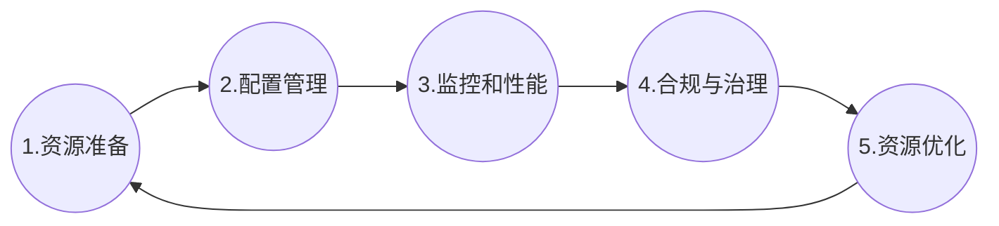

## 基础架构即代码简介

> 基础架构即代码（IaC）是通过代码（而非手动流程）来管理和置备基础架构的方法。

利用 IaC，我们可以创建包含基础架构规范的配置文件，从而便于编辑和分发配置。此外，它还可确保每次置备的环境都完全相同。

通过对配置规范进行整理和记录，IaC 有助于实现配置管理，并避免发生未记录的临时配置更改。

版本控制是 IaC 的一个重要组成部分，就像其他任何软件源代码文件一样，配置文件也应该在源代码控制之下。

以基础架构即代码方式部署还意味着您可以将基础架构划分为若干模块化组件，它们可通过自动化以不同的方式进行组合。

IaC 可以帮助您的企业管理 IT 基础架构需求，同时提高一致性并减少错误和手动配置。其优势非常明显：

- 降低成本
- 加快部署速度
- 减少错误
- 提高基础架构一致性
- 消除配置偏移

## 基础架构资源生命周期

## 工具选择

IaC 工具非常多，流行的有：

- Chef
- Puppet
- Anisble
- SaltStack
- Terraform
- AWS CloudFormation
  
选择工具时，要考虑以下因素：

- 声明式与命令式
- 可变基础架构与不可变基础架构
- 代理与无代理

### 声明式和命令式

IaC 有两种实施方法：声明式或命令式。

- 声明式方法定义了系统的预期状态，包括所需的资源以及它们应具有的属性，随后 IaC 工具会为您进行相关配置。声明式方法还将保留系统对象的当前状态列表，因此在移除基础架构时会更便于管理。
- 命令式方法则定义了实现预期配置所需的特定命令，最后需要以正确的顺序执行这些命令。

Chef 和 Ansible 采用命令式代码，Terraform, CloudFormation, SaltStack 和 Puppet 都采用声明性代码，

### 可变基础架构和不可变基础架构

​Chef，Puppet，Ansible 和 SaltStack 等配置管理工具通常默认为可变基础架构。例如，如果您告诉Chef安装新版本的OpenSSL，它将在您现有的服务器上运行软件更新，更改将就地进行。随着时间的流逝，随着您应用越来越多的更新，每台服务器都会建立唯一的更改历史记录。这通常会导致一种称为配置漂移，其中每台服务器与所有其他服务器都略有不同，从而导致难以诊断且几乎无法重现的细微配置错误。

​如果您使用诸如 Terraform 之类的配置工具来部署由Docker或Packer创建的机器映像，那么每个“更改”实际上就是一个新服务器的部署。例如，要部署新版本的OpenSSL，您可以使用Packer或Docker创建一个新映像，并安装新版本的OpenSSL，然后在一组全新服务器上部署该映像，然后取消部署旧服务器。这种方法减少了配置漂移的可能性，使您更容易准确地知道服务器上正在运行的软件，并允许您随时轻松地部署该软件的任何先前版本。

### 代理与无代理

​Chef，Puppet 和 SaltStack 都要求您在要配置的每台服务器上安装代理软件（例如Chef Client，Puppet Agent，Salt Minion）。该代理通常在每台服务器上在后台运行，并负责安装最新的配置管理更新，这带来了一些缺点：

- 维护：必须定期定期更新代理软件，如果有的话，请注意使其与主服务器保持同步。您还必须监视代理软件，并在崩溃时重新启动它。
- 安全性：如果代理软件从主服务器（如果不使用主服务器，则从其他服务器）下载配置，则必须在每台服务器上打开出站端口。如果主服务器将配置推送到代理，则必须在每台服务器上打开入站端口。
  
如果使用 Terraform 就无需担心上述问题：只需发出请求命令，云提供商的代理即可在所有服务器上执行命令。
