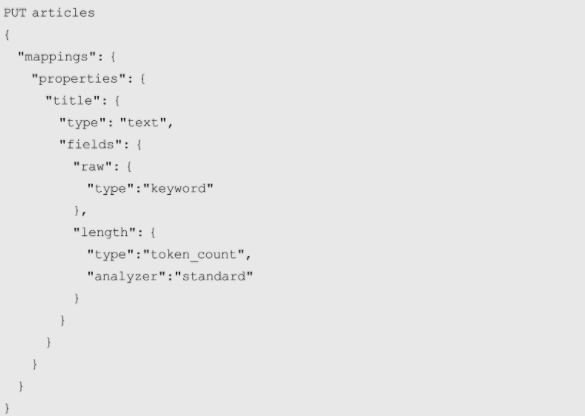

## 准实时

在默认情况下，Elasticsearch每隔1s刷新索引，所以是准实时的。

1. **index.refresh_interval：** 默认值1s。设置索引刷新间隔，-1不刷新。
2. **index.search.idle.after：** 默认值30s。如果index.refresh_interval未设置，30s以上没有收到检索请求的索引不会刷新。如果不需要这个特性，必须显式设置index.refresh_interval。
3. _refresh接口或refresh参数，强制刷新索引。
4. 缓冲区配置参数，包括**indices.memory.index_buffer_size**、indices.memory.min_index_buffer_size和indices.memory.max_index_buffer_size。默认情况下，这个缓冲区最小为48MB且没有上限。

## 为什么要自定义映射？

Defining your own mappings enables you to:

- Distinguish between full-text string fields and exact value string fields
- Perform language-specific text analysis
- Optimize fields for partial matching
- Use custom date formats
- Use data types such as geo_point and geo_shape that cannot be automatically detected

## 字段存储

在默认情况下，文档的所有字段都会创建倒排索引。这可以通过字段的index参数来设置，其默认值为true。

对于text类型的字段，它们会被解析为词项后再以词项为单位编入索引。编入索引的信息包括：

1. **文档ID**，文档的惟一标识，由文档中的元字段_id保存。
2. **词频**，词项在字段中出现的频率，它可以反映检索结果的相关性。
3. **词序**，词项在所有词项中的次序，主要用于短语查询（Phrase Query）。
4. **词项偏移量**，给出了词项在字段中的实际位置，一般用于高亮检索结果。

**出于对性能与效率的考量，字段原始值不会被编入索引。**

但索引提供了一个叫 **_source** 的字段用于存储整个文档的原始值。

Elasticsearch还提供了另外一种机制保存字段值，这就是文档值（Doc Value）机制。

文档值机制存储的信息与_source字段基本相同，但它的存储结构是面向列的，类似于传统关系型数据库中的表结构。在默认情况下，所有非text类型的字段都支持文档值机制，并且都是开启的。

对于text类型的字段来说，Elasticsearch提供了另外一种称为fielddata的机制来处理相似场景的问题。

fielddata机制与文档值机制虽然在效果上类似，但在实现上则完全不同。文档值机制的数据结构保存在硬盘中，而fielddata机制则是在内存中构建数据结构，所以使用fielddata机制有可能导致JVM内存溢出。不仅如此，fielddata机制保存的也不是字段原始值，而是通过遍历倒排索引建立文档与它所包含词项的对应关系。具体来说，Elasticsearch会在首次对字段进行聚集、排序等请求时，遍历所有倒排索引并在内存中构建起文档与词项之间的对应关系。在默认情况下，text字段的fielddata机制是关闭的，可以通过在映射字段时修改fielddata参数开启。

**除了使用_source字段、文档值和fielddata机制以外，在字段映射时还可以通过store参数将字段修改为true，以使索引单独保存这个字段。**

例如对于书名和书的内容来说，书的内容要比书名长得多，而书名在许多情况下又需要单独使用，如果每次需要取书名时都需要将书的内容也返回就有点太浪费了。在这种情况下就可以使用store参数，将书名设置为单独存储，然后就可以使用stored_fields单独检索这些字段了。

**copy_to参数可以将字段值复制到另外一个字段，这样就可以将相关字段值复制到同一个字段中，而在需要做跨字段检索时就可以使用这个字段了。**

## 字段数据类型

Elasticsearch支持的数据类型包括三类：

- 核心数据类型：字符串、数值、日期、布尔、二进制、范围等，
- 数组、对象等衍生类型，
- 嵌套、关联、地理信息等特殊类型。

字符串类型包括text和keyword两种类型，两者的区别在于text类型在存储前会做词项分析，而keyword类型则不会。

针对字符串类型text和keyword，Elasticsearch专门提供了一个用于配置字段多数据类型的参数fields，它能让一个字段同时具备两种数据类型的特征。



## 分片与复制

索引分片数量是在创建索引时通过**number_of_shards**参数设置的。当有新的节点加入集群时，Elasticsearch会将分片均衡地散列到新的节点。

在Elasticsearch中，确定文档存储在哪一个分片中的机制被称为路由（Routing）。计算文档路由的具体运算公式如下：

```properties
shard_nums=hash(_routing)%num_primary_shards
```

在默认情况下，文档的_routing参数是文档ID，可以通过在添加或检索文档时设置routing参数修改。

Elasticsearch又引入了另一个分区参数来平衡路由运算，这就是routing_partition_size。引入这个参数后，路由运算公式变为：

```properties
shard_nums=(hash(_routing)+hash(_id)%routing_partition_size)%num_primary_shards
```

为了避免重新索引导致的性能开销，Elasticsearch严格限制索引分片数量不能再修改。当文档实际存储量与索引容量不相符时，需要创建新的索引，再将原索引中的文档存储到新的索引中。Elasticsearch针对这种情况提供了三个接口，即_split接口、_shrink接口和_reindex接口。
