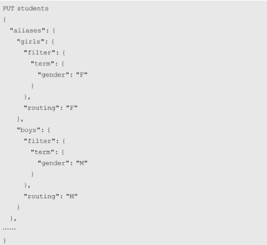

## 索引别名

索引别名可以类比为关系型数据库中的视图，Elasticsearch在处理别名时会自动将别名转换为对应的索引名称。

索引别名一般都会与一些过滤条件相关联。在定义过滤条件时通常要指定路由规则，这样会将同一别名的文档路由到相同的分片上，可以有效减少使用别名检索时的分片操作。但这也要求在存储文档时必须要通过别名，否则在使用别名检索时有可能会漏掉合法文档。



别名可以与多个索引关联，这种设计在一些应用场景中十分有价值。如果文档数量整体容量不可估算并且每天都在增加，可以按时间段每隔一段时间就创建一个新索引。再给这些索引关联相同的别名，这样在检索文档时就可以对它们共同的别名做检索，避免了不停变换索引名称带来的麻烦。

**为索引添加/删除别名**


**将别名指向新索引**

_rollover接口用于根据一系列条件将别名指向一个新的索引，这些条件包括存续时间、文档数量和存储容量等。


## 动态映射与索引模板

- **action.auto_create_index=false** 禁止在不创建索引的情况下直接向索引中添加文档。
- **dynamic=true,false,strict** 是否支持向索引中增加新字段
- **date_detection=false**关闭日期自动解析
- **dynamic_date_formats** 设置日期格式
- **mappings.dynamic_templates** 用于自定义动态添加字段时的映射规则
- **索引模板** 定义了在创建索引时默认为索引添加的别名、配置和映射等信息，Logstash和Beats会用到

## _mapping接口

_mapping接口可以查看和修改索引的映射关系。

```
GET /_mapping
GET /bank/_mapping
GET /bank/_mapping/field/address
```

字段只能添加和修改，不能删除，而且修改非常局限，只能修改ignore_above。

```json
PUT /bank/_mapping
{
  "properties": {
    "address": {
      "type": "text",
      "fields": {
        "keyword": {
          "type": "keyword",
          "ignore_above": 256
        }
      }
    }
  }
}
```

由此可见，在设计索引时一定要做好规划，在初始时可以只加入必要字段。为了隔离索引变化对用户的影响，可以只提供索引别名给用户访问，当索引发生变化时只要把别名分配到新索引就可以了。

## _split接口和_reindex接口

_split接口可以在新索引中将每个主分片分裂为两个或更多分。

1. 创建索引employee，number_of_shards设置为2，number_of_routing_shards设置为12。
2. blocks.write参数设置为true，将索引设置为只读。
3. 调用_split接口将employee索引的分片分裂到新索引splited_employee中，index.number_of_shards参数设置为4(number_of_shards的倍数，number_of_routing_shards的因数)。

```json
PUT /employee
{
  "settings": {
    "number_of_shards": 2,
    "number_of_routing_shards":12
  }
}
PUT /employee/_settings
{
  "blocks.write": true
}
PUT /employee/_split/splitted_employee
{
  "settings": {
    "index.number_of_shards": 4,
    "number_of_replicas": 12,
    "index.blocks.write": false
  },
  "aliases": {
    "stu": {}
  }
}
```

_split接口成功分裂分片后，原索引并不会被自动删除，是否删除应根据业务需要具体判断。

使用_split接口分裂分片虽然会创建新的索引，但新索引中的数据只是通过文件系统硬连接到新索引中，所以并不存在数据复制过程。而扩容的分片又是在本地分裂，所以不存在不同节点间网络传输数据的开销，所以_split扩容效率相对其他方案来说还是比较高的。

_reindex接口支持将文档从一个索引重新索引到到另一个索引中。但显然重新索引在性能上的开销要比_split和_shrink大.

在实际应用中，_reindex接口并不是应用于扩容和缩容，而是主要应用于索引数据的合并。

## 缓存机制

1. 节点查询缓存（Node Query Cache）：
   - index.queries.cache.enabled 是否启用，默认true
   - indices.queries.cache_size 设置节点查询缓存容量，默认节点内容10%
2. 分片请求缓存（Shard Request Cache）：
   - index.requests.cache.enable 是否启用，默认true
3. text类型字段在开启fielddata机制后使用的缓存：
   - indices.fielddata.cache.size设置这个缓存的容量，默认情况下没有容量上限。

一致性保证：Elasticsearch通过让缓存与索引刷新频率保持一致实现缓存数据一致性。在索引更新的同时让缓存也失效，这就保证了索引数据与缓存数据的一致性。

淘汰机制：LRU。

Elasticsearch还提供_cache接口主动刷新缓存，一般在_refresh接口调用后主动刷新下缓存。

## 查看运行状态

_stats接口查看统计信息：

```
GET _stats
GET _stats/store
GET /bank/_stats
GET /bank/_stats/fielddata
```

_shard_stores接口查询索引分片存储情况：

```
GET _shard_stores
GET /bank/_shard_stores
```

_segments接口查看底层Lucene的分段情况：

```
GET _segments
GET /bank/_segments
```

## 操作文档

**添加（索引）文档：**

- POST /bank/_doc：POST非幂等，不带id是会自动生成id。
- PUT /bank/_doc/1： PUT更新整个文档，幂等，_version加1。
- PUT /bank/_doc/1?version=1：乐观锁

**查看文档：**

```
GET /bank/_doc/1
GET /bank/_doc/1?_source=firstname,lastname
```

**删除文档：**

```json
DELETE /bank/_doc/1
DELETE /bank/_delete_by_query
{
  "query":{
    "match": {
      "firstname": "Tom"
    }
  }
}
```

**_update更新字段：**

```json
POST /bank/_update/1
{
  "doc": {
    "gender": "M"
  }
}
```

```json
POST /bank/_update_by_query
{
  "script": {
    "source": "ctx._source.age++"
  },
  "query":{
      "exists":{
          "field":"age"
      }
  }
}
```

**_bulk 批量操作：**

_bulk接口接收一组请求体，请求体一般每两个一组，第一个请求体代表操作文档的类型，而第二个请求体则代表操作文档所需要的参数。但对于某些不需要参数的文档操作来说，则可能只有一个请求体。

操作类型包括index、create、delete、update等，其中index和create都代表创建文档，区别在于当要创建的文档存在时，create会失败而index则可以变为更新；delete和update则分别代表删除和更新文档。

官方文档中的account.json的格式如下：

```json
{"index":{"_id":"1"}}
{"account_number":1,"balance":39225,"firstname":"Amber","lastname":"Duke","age":32,"gender":"M","address":"880 Holmes Lane","employer":"Pyrami","email":"amberduke@pyrami.com","city":"Brogan","state":"IL"}
{"index":{"_id":"6"}}
{"account_number":6,"balance":5686,"firstname":"Hattie","lastname":"Bond","age":36,"gender":"M","address":"671 Bristol Street","employer":"Netagy","email":"hattiebond@netagy.com","city":"Dante","state":"TN"}
{"index":{"_id":"13"}}
```
