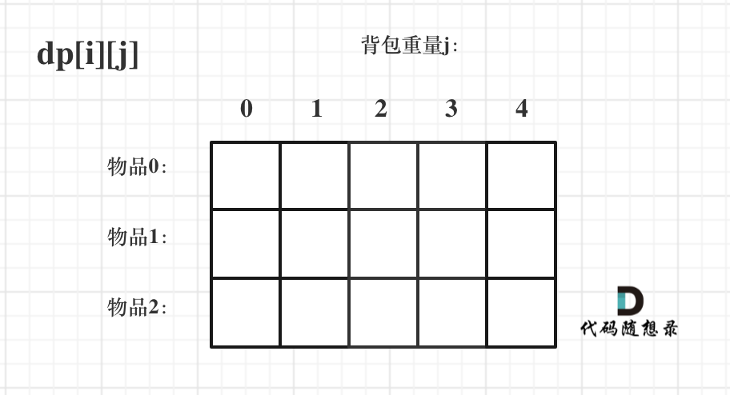

## 问题
有 N 件物品和一个最多能被重量为 W 的背包。第i件物品的重量是 weight[i]，价值是 value[i] 。每件物品只能装一次，将哪些物品装入背包获得的价值最大？

示例：

背包最大重量为：bagWeight=4。

物品重量和价值表：


| 物品  | 重量 | 价值 |
| :---- | :--- | :--- |
| 物品0 | 1    | 15   |
| 物品1 | 3    | 20   |
| 物品2 | 4    | 30   |

该题典型解法是动态规划。

## 1. 确定dp数组
二维数组 **dp[i][j]** 表示从下标为 **[0-i]** 的物品里任意取，放进容量为 **j** 的背包，所取得的最大价值。



## 2. 确定递推公式
可以有两个方向推出来dp[i][j]：选不选物品i。
  
如果不选物品i，则 dp[i][j]=dp[i-1][j]。

如果选物品。由于物品i的重量为weight[i]，价值为value[i]，所以问题转化为：背包重量为 j-weight[i] 时，从[0,i-1]物品中选择，获取最大价值，即 dp[i-1][j-weight[i]]。这时dp[i][j]=dp[i-1][j-weight[i]] + value[i]
  

所以递归公式为：
```
dp[i][j] = max(dp[i-1][j], dp[i-1][j-weight[i]] + value[i]);
```
## 3. 初始化dp数组
根据dp数组的定义，我们要初始化两个维度：dp[0][j]和dp[i][0]。

dp[i][0]表示背包容量为0时最大价值，显然都是0，即dp[i][0]=0。

dp[0][j]表示只选0号物品时的最大价值，所以要么是value[0],要么是0，取决于value[0]与j的大小。

```java
for (int j = 1; j <= bagWeight; i++) {
   if(value[0] <= j){
     dp[0][j] = value[0]; 
   }
}
```
## 4. 代码实现
```java
package com.example.demo.algorithms;

public class BagPack {
    /**
     * 背包总重量
     */
    private static int bagWeight = 4;
    /**
     * 物品重量
     */
    private static int[] weight = {1, 3, 4};
    /**
     * 物品价值
     */
    private static int[] value = {15, 20, 30};

    public static int getBagValue01() {
        int n = weight.length;
        int[][] dp = new int[n][bagWeight + 1];
        for (int j = 1; j <= bagWeight; j++) {
            if (j >= weight[0]) {
                dp[0][j] = value[0];
            }
        }

        for (int i = 1; i < n; i++) {
            for (int j = 1; j <= bagWeight; j++) {
                if (j < weight[i]) {
                    dp[i][j] = dp[i - 1][j];
                } else {
                    dp[i][j] = Math.max(dp[i - 1][j], dp[i - 1][j - weight[i]] + value[i]);
                }
            }
        }
        return dp[n - 1][bagWeight];
    }
}
```
## 5.leetcode背包问题
- [416.分割等和子集](https://leetcode-cn.com/submissions/detail/169851311/)：01背包变种
- [1049.最后一块石头的重量 II](https://leetcode-cn.com/problems/last-stone-weight-ii/)：01背包变种
- [494.目标和](https://leetcode-cn.com/problems/target-sum/)：01背包变种，放满背包所有可能性
- [474.一和零](https://leetcode-cn.com/problems/ones-and-zeroes/])：01背包变种，二维背包


