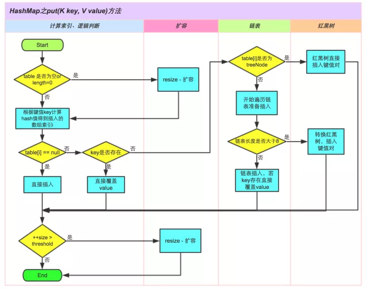
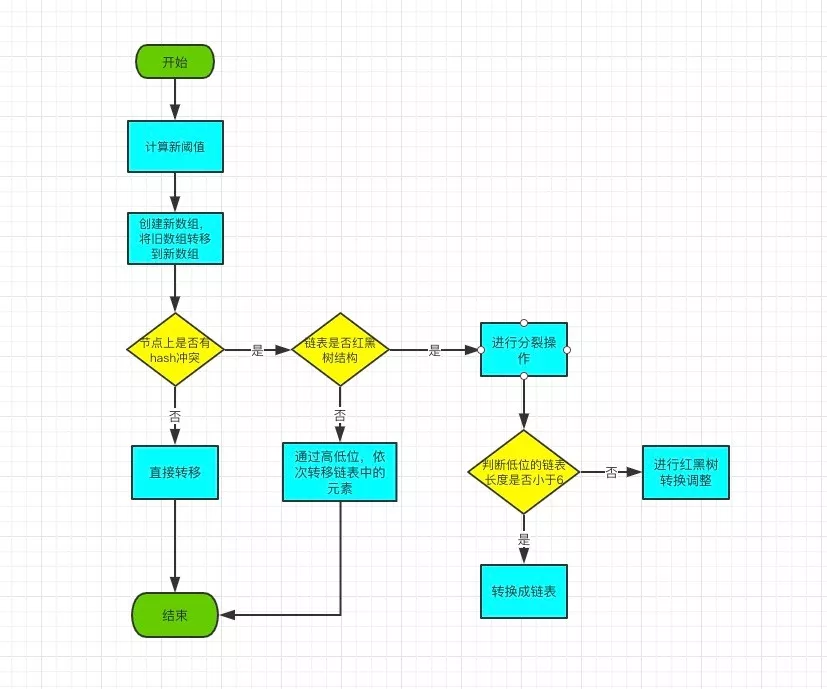

### 基本结构

HashMap 基于哈希表实现，底层是一个数组。将 key 和 value 封装成一个节点 Node，通过对 key 进行哈希计算后与长度求余确定节点存放的位置：

```java
transient Node<K,V>[] table;

static class Node<K,V> implements Map.Entry<K,V> {
    final int hash;
    final K key;
    V value;
    Node<K,V> next;
```

哈希算法会存在冲突，HashMap 解决冲突的方式是链式法，当链表太长时会转成红黑树:

```java
//链表长度到8时转红黑树
static final int TREEIFY_THRESHOLD = 8;
// 只有当容量不小于 64 才可能执行树化
static final int MIN_TREEIFY_CAPACITY = 64;
//红黑树节点减少到6时，换回链表
static final int UNTREEIFY_THRESHOLD = 6;
```

扩容机制：随着节点增多，冲突会越来越严重，性能下降。所以引入扩容机制：

```java
//负载因子，当 size= capacity*loadFactor 时扩容
final float loadFactor;
static final float DEFAULT_LOAD_FACTOR = 0.75f;
static final int DEFAULT_INITIAL_CAPACITY = 1 << 4; // aka 16
transient int size;
```

## hash方法

计算 key.hashCode() 并将较高位（异或）传播到较低位。

```java
static final int hash(Object key) {
    int h;
    return (key == null) ? 0 : (h = key.hashCode()) ^ (h >>> 16);
}
```

## put 方法

```java
final V putVal(int hash, K key, V value, boolean onlyIfAbsent, boolean evict) {
    Node<K,V>[] tab; Node<K,V> p; int n, i;
    
    if ((tab = table) == null || (n = tab.length) == 0)
        n = (tab = resize()).length;
    
    if ((p = tab[i = (n - 1) & hash]) == null)
        tab[i] = newNode(hash, key, value, null);
    else {
        Node<K,V> e; K k;
        if (p.hash == hash &&
            ((k = p.key) == key || (key != null && key.equals(k))))
            e = p;
        else if (p instanceof TreeNode)
            e = ((TreeNode<K,V>)p).putTreeVal(this, tab, hash, key, value);
        else {
            for (int binCount = 0; ; ++binCount) {
                if ((e = p.next) == null) {
                    p.next = newNode(hash, key, value, null);
                    if (binCount >= TREEIFY_THRESHOLD - 1) // -1 for 1st
                        treeifyBin(tab, hash);
                    break;
                }
                if (e.hash == hash &&
                    ((k = e.key) == key || (key != null && key.equals(k))))
                    break;
                p = e;
            }
        }
        if (e != null) { // existing mapping for key
            V oldValue = e.value;
            if (!onlyIfAbsent || oldValue == null)
                e.value = value;
            afterNodeAccess(e);
            return oldValue;
        }
    }
    ++modCount;
    if (++size > threshold)
        resize();
    afterNodeInsertion(evict);
    return null;
}
```

put方法的流程：



## 扩容


