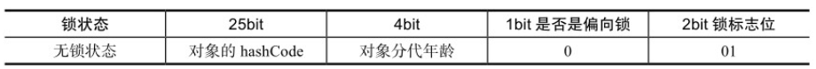
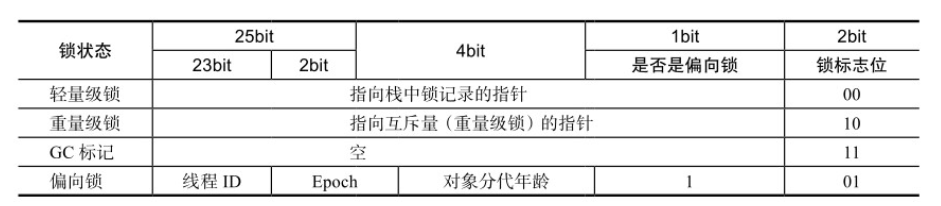
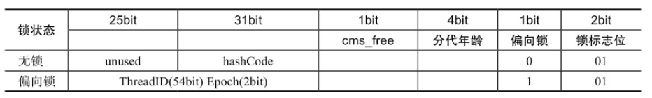

## synchonized实现原理

synchonized本质上是一种基于监视器的锁。JVM基于进入和退出监视器对象来实现同步，分别使用monitorenter和monitorexit指令。

任何对象都有一个监视器与之关联。当监视器被持有后，它将处于锁定状态。线程执行到monitorenter指令时，会尝试获取对象的监视器，即尝试获取锁。

## Java对象头

在HotSpot虚拟机中，对象在内存中的布局分为3块：对象头、实例数据和对齐填充。

对象头由三部分组成：
- Mark Word：存储对象的HashCode、分代年龄和锁标记位
- 类型指针：存储到对象类型的指针
- 数组长度：如果是数组对象，要存储数组长度

32位JVM的Mark Word的默认存储结构：

在运行期间，可能变化为存储以下4种数据:

64位虚拟机下，Mark Word存储结构:

