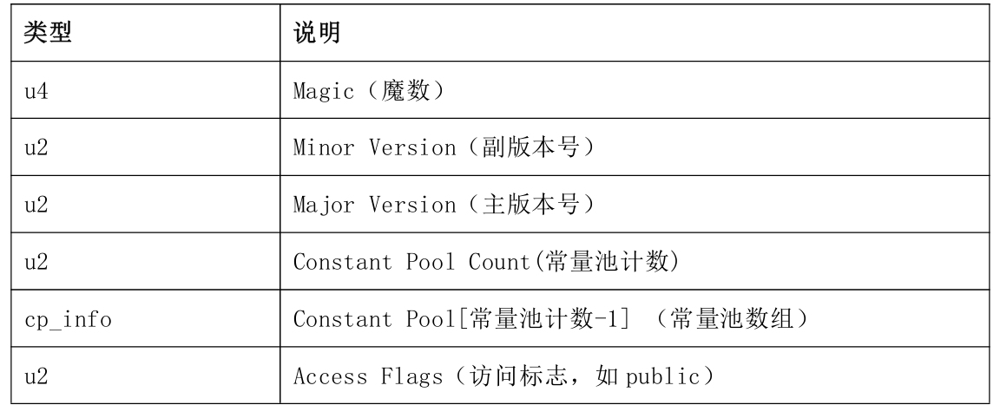

## class文件结构


魔数占四个字节，固定值为0xCAFEBABE，这个值永远不会改变。

class文件结构的版本号分为主版本号和副版本号，它们共同构成class文件格式的版本号。JDK1.8的主版本号为52.

this_class和super_class指向的常量必须是一个CONSTANT_Class_info结构的常量(类或接口的符合引用)。

如何取得类名？根据this_class的值到常量池取得对应的CONSTANT_Class_info常量，再从取得的CONSTANT_Class_info常量中获取该常量的name_index的值，最后根据name_index再回到常量池中取得对应的CONSTANT_Utf8_info常量，这样就能获取到具体的类名了。

### 常量池
常量池表中所有常量项的结构都包含一个tag项，tag值用于标志一个常量是哪种常量结构。只有根据tag确定常量的结构，才能根据常量结构计算常量所占用的字节数。
```java
cp_info{
    u1 tag;
    u1 info[];
}
```
tag与常量结构映射表:


### 访问标志
