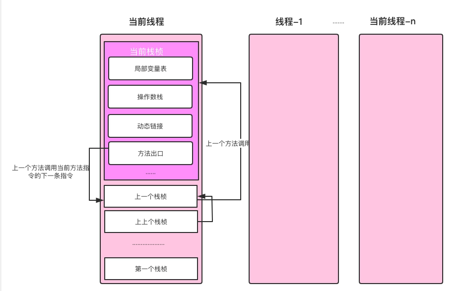
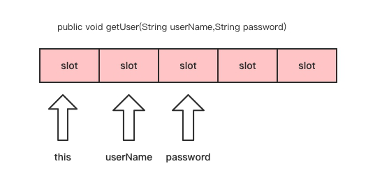
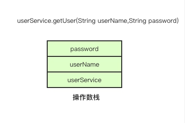
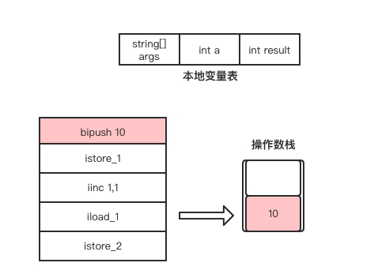
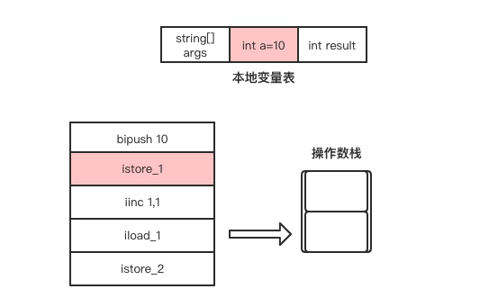
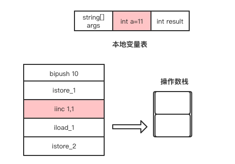
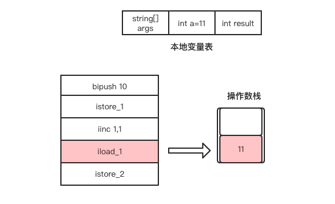
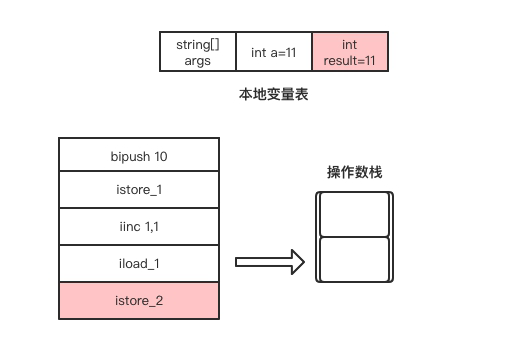

## 线程、栈与栈桢
在Java中，Java线程与操作系统一对一绑定，Java虚拟机栈也与操作系统线程栈映射，操作系统线程在Java线程创建时创建。-Xss配置虚拟机栈的大小便是指定操作系统线程栈的大小。



## 局部变量表
局部变量表存储方法中声明的变量、方法参数，如果是非静态方法还会存放this引用。

局部变量表的结构是一个数组，数组的单位是Slot（变量槽），Slot的大小是多少个字节由虚拟机决定。在32位的HotSpot虚拟机中，一个Slot槽的大小是4个字节，而在64位的HotSpot虚拟机中，一个Slot槽的大小是8个字节，在开启指针压缩的情况下，一个Slot槽的大小是4个字节。



## 操作数栈
操作数栈与局部变量表一样，大小也是固定的，也是在编译期确定，单位也是Slot。

操作数栈用于存储执行字节码指令所需要的参数。比如获取对象自身的字段，需要先将this引用压入栈顶，再执行getfield字节码指令；比如执行new指令后，栈顶会存放该new指令返回的对象的引用。



## 基于栈的指令集架构
在汇编语言中，除直接内存操作的指令外，其它指令的执行都依赖寄存器，如跳转指令、循环指令、加减法指令等。

汇编指令不能直接操作将一块内存的值赋值给另一块内存，必须要通过寄存器。32位x86 CPU包括8个通用寄存器，EAX、EBX、ECX、EDX、ESP、EBP、ESI、EDI，其中EBP、ESP用做指针寄存器，存放堆栈内存储单元的偏移量。

示例：
```java
public static void main(String[] args){
    int a=10;
    int result=++a;
    System.out.println(result);
}
```
使用javap命令输出这段代码的字节码如下。
```java
public static void main(java.lang.String[]);
    Code:
        0: bipush        10
        2: istore_1
        3: iinc          1, 1
        6: iload_1
        7: istore_2
        8: getstatic     #2   // Field java/lang/System.out:Ljava/io/PrintStream;
        11: iload_2
        12: invokevirtual #3  // Method java/io/PrintStream.println:(I)V
        15: return
```
其过程如下：
1. bipush指令将立即数10放入到操作数栈顶。

2. istore_1指令将操作数栈顶的元素从操作数栈出弹出，并存放到局部变量表中索引为1的Slot，也就是赋值给变量a。
  
3. iinc指令直接操作局部变量表的变量，而不需要经过操作数栈。该指令将局部变量表中索引为1的Slot所存储的整数值自增1，也就是将局部变量a自增1。

4. iload_1指令将自增后的变量a放入操作数栈的栈顶。

5. istore_2指令是将当前操作数栈顶的元素从操作数栈弹出，并存放到局部变量表中索引为2的Slot，也就是给result变量赋值。
