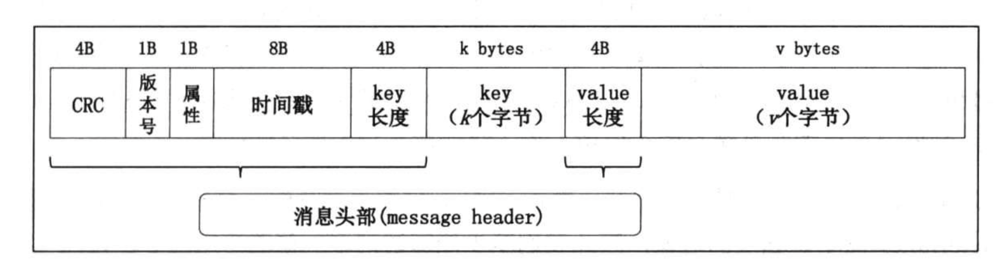

### 设计特点
- 消息设计：基于TCP的二进制消息传输协议。优点：结构紧凑，节省内存，便于使用堆外内存，充分利用页缓存优点。
- 生产者和消费者解耦，灵活支持队列和发布订阅模式，不同级别的可靠性保证。
- 吞吐量/延时：只写入页缓存，追加写，零拷贝。
- 持久化：消息写入文件系统后才会返回客户端结果，而不是先内存缓存。优点：数据安全，省下内存给页缓存。
- 负载均衡：智能化分区领导者选举，各节点以均等的机会分散leader partition。
- 故障转移：broker与zookeeper保持会话，会话超时后集群选举另一broker替代其服务。
- 伸缩性：绝大部分集群状态由zookeeper管理，简化了kafka集群的扩展。新版本正去zookeeper，拥抱raft。

### 消息格式
- 不同版本：V0，V1，V2
- 组成部分：消息头，key，value。
- 消息头：CRC码，版本号，属性，时间戳，key长度，value长度。

### topic和partition
消息被组织并持久化到topic，多生产者-多消费者模式，持久存储，可多次消费。topic可分区，这些分区均衡分布到所有broker上，是kafka高扩展性的关键设计。

- 每个topic可以有多个分区，通过 