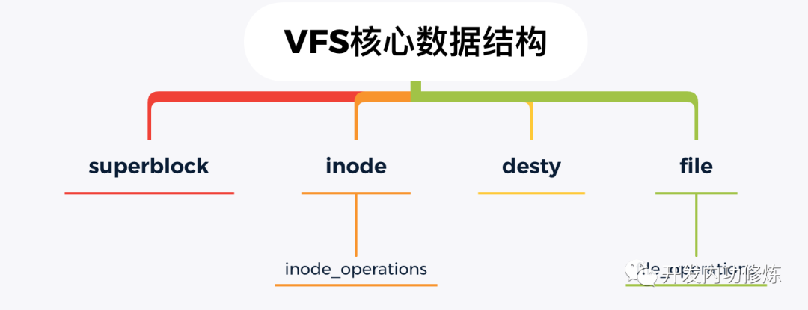
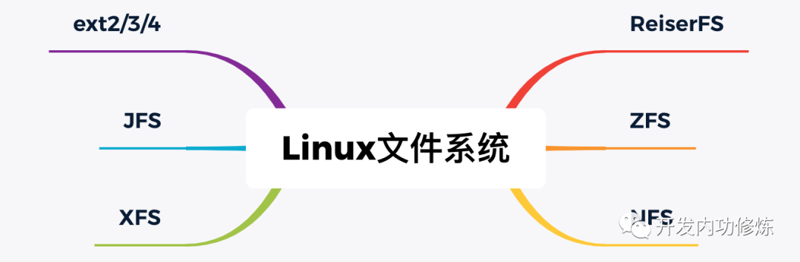

# read 文件一个字节实际会发生多大的磁盘IO？

> 原文：https://mp.weixin.qq.com/s/vekemOfUHBjZSy3uXb49Rw  
> 微信公众号： 开发内功修炼

对某个文件读取一个字节:
```c
int main(){
    char c;
    f=open("file.txt",O_RDONLY);
    read(f,&c,1)
}
```
基于这个代码片段我们来思考：
1. 读取文件 1 个字节是否会导致磁盘 IO ？
2. 如果发生了磁盘 IO，那发生的是多大的 IO 呢？

## 一、大话 Linux IO 栈

废话不多说，我画了一个 Linux IO 栈的简化版本。


### IO 引擎
开发同学想要读写文件的话，在 lib 库层有很多套函数可以选择，比如 read & write，pread & pwrite。这事实上就是在选择 Linux 提供的 IO 引擎。

常见的 IO 引擎种类如下：


### VFS

VFS 的思想就是在 Linux 上抽象一个通用的文件系统模型，对我们开发人员或者是用户提供一组通用的接口，让我们不用 care 具体文件系统的实现。



VFS 提供的核心数据结构有四个，它们定义在内核源代码的 include/linux/fs.h 和 include/linux/dcache.h 中。

- superblock：Linux 用来标注具体已安装的文件系统的有关信息。
- inode：Linux 中的每一个文件/目录都有一个 inode，记录其权限、修改时间等信息。
- desty：目录项，是路径中的一部分，所有的目录项对象串起来就是一棵 Linux 下的目录树。
- file：文件对象，用来和打开它的进程进行交互。


围绕这这四个核心数据结构，VFS 也都定义了一系列的操作方法。比如，inode 的操作方法定义 inode_operations，在它的里面定义了我们非常熟悉的 mkdir 和 rename 等。

对于 file 对象，定义了对应的操作方法 file_operations ，如下：
```c
// include/linux/fs.h
struct file {
    ......
    const struct file_operations    *f_op
}
struct file_operations {
    ......
    ssize_t (*read) (struct file *, char __user *, size_t, loff_t *);
    ssize_t (*write) (struct file *, const char __user *, size_t, loff_t *);
            ......
    int (*mmap) (struct file *, struct vm_area_struct *);
    int (*open) (struct inode *, struct file *);
    int (*flush) (struct file *, fl_owner_t id);
}
```

### 页缓存
页缓存是 Linux 内核使用的主要磁盘高速缓存，是一个纯内存的工作组件。Linux 内核使用搜索树来高效管理大量的页面。

如果要访问的文件块正好存在于页缓存内，那么 Page Cache 组件直接把数据从内核态拷贝到用户进程的内存中就可以了。如果不存在，那么会申请一个新页，发出缺页中断，然后用磁盘读取到的块内容来填充它，下次直接使用。

不过有一种情况下，Pagecache 不会生效， 那就是你设置了 DIRECT_IO 标志。

### 文件系统
Linux 下支持的文件系统有很多，常用的有 ext2/3/4、XFS、ZFS 等。

要用哪种文件系统是在格式化的时候指定的。因为每一个分区都可以单独进行格式化，所以一台 Linux 机器下可以同时使用多个不同的文件系统。



文件系统里提供对 VFS 的具体实现。除了数据结构，每个文件系统还会定义自己的实际操作函数。例如在 ext4 中定义的 ext4_file_operations。在其中包含的VFS中定义的 read 函数的具体实现：do_sync_read 和 do_sync_write。


### 通用块层
文件系统还要依赖更下层的通用块层。

对上层的文件系统，通用块层提供一个统一的接口让供文件系统实现者使用，而不用关心不同设备驱动程序的差异，这样实现出来的文件系统就能用于任何的块设备。通过对设备进行抽象后，不管是磁盘还是机械硬盘，对于文件系统都可以使用相同的接口对逻辑数据块进行读写操作。

对下层。I/O 请求添加到设备的 I/O 请求队列。它定义了一个叫 bio 的数据结构来表示一次 IO 操作请求（include/linux/bio.h）

### IO 调度层
当通用块层把 IO 请求实际发出以后，并不一定会立即被执行。因为调度层会从全局出发，尽量让整体磁盘 IO 性能最大化。

对于机械硬盘来说，调度层会尽量让磁头类似电梯那样工作，先往一个方向走，到头再回来，这样整体效率会比较高一些。具体的算法有 deadline 和 cfg ，算法细节就不展开了，感兴趣同学可以自行搜索。

对于固态硬盘来说，随机 IO 的问题已经被很大程度地解决了，所以可以直接使用最简单的 noop 调度器。

在你的机器上，通过dmesg | grep -i scheduler来查看你的 Linux 支持的调度算法。

## 二、读文件过程


## 三、回顾开篇问题
回到开篇的第一个问题：读取文件 1 个字节是否会导致磁盘 IO ？

从上述流程中可以看到，如果 Page Cache 命中的话，根本就没有磁盘 IO 产生。

所以，大家不要觉得代码里出现几个读写文件的逻辑就觉得性能会慢的不行。操作系统已经替你优化了很多很多，内存级别的访问延迟大约是 ns 级别的，比机械磁盘 IO 快了好几个数量级。如果你的内存足够大，或者你的文件被访问的足够频繁，其实这时候的 read 操作极少有真正的磁盘 IO 发生。

假如 Page Cache 没有命中，那么一定会有传动到机械轴上进行磁盘 IO 吗？

其实也不一定，为什么，因为现在的磁盘本身就会带一块缓存。另外现在的服务器都会组建磁盘阵列，在磁盘阵列里的核心硬件Raid卡里也会集成RAM作为缓存。只有所有的缓存都不命中的时候，机械轴带着磁头才会真正工作。

再看开篇的第二个问题：如果发生了磁盘 IO，那发生的是多大的 IO 呢？

如果所有的 Cache 都没有兜住 IO 读请求，那么我们来看看实际 Linux 会读取多大。真的按我们的需求来，只去读一个字节吗？

整个 IO 过程中涉及到了好几个内核组件。而每个组件之间都是采用不同长度的块来管理磁盘数据的。
- Page Cache 是以页为单位的，Linux 页大小一般是 4KB
- 文件系统是以块(block)为单位来管理的。使用 dumpe2fs 可以查看，一般一个块默认是 4KB
- 通用块层是以段为单位来处理磁盘 IO 请求的，一个段为一个页或者是页的一部分
- IO 调度程序通过 DMA 方式传输 N 个扇区到内存，扇区一般为 512 字节
- 硬盘也是采用“扇区”的管理和传输数据的

可以看到，虽然我们从用户角度确实是只读了 1 个字节。但是在整个内核工作流中，最小的工作单位是磁盘的扇区，为512字节，比1个字节要大的多。

另外 block、page cache 等高层组件工作单位更大。其中 Page Cache 的大小是一个内存页 4KB。所以一般一次磁盘读取是多个扇区（512字节）一起进行的。假设通用块层 IO 的段就是一个内存页的话，一次磁盘 IO 就是 4 KB（8 个 512 字节的扇区）一起进行读取。

另外我们没有讲到的是还有一套复杂的预读取的策略。所以，在实践中，可能比 8 更多的扇区来一起被传输到内存中。