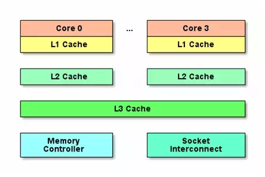
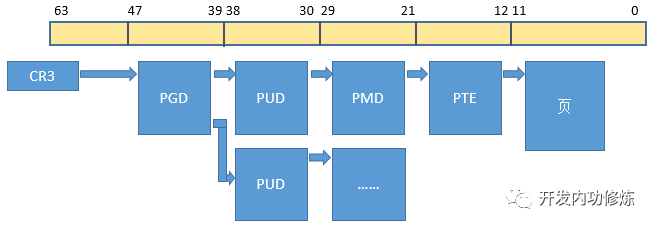

## cpu基本信息
CPU基本概念：
>物理CPU：主板上真正安装的CPU的个数。  
物理核：一个CPU会集成多个物理核心。  
逻辑核：超线程技术可以把一个物理核虚拟出来多个逻辑核。  
缓存行：cpu从缓存中取数据的大小，一般为64字节




查看cpu信息：
```shell
lscpu
Architecture:          x86_64
CPU op-mode(s):        32-bit, 64-bit
Byte Order:            Little Endian
CPU(s):                16
On-line CPU(s) list:   0-15
Thread(s) per core:    1
Core(s) per socket:    4
Socket(s):             4
NUMA node(s):          4
Vendor ID:             GenuineIntel
CPU family:            6
Model:                 85
Model name:            Intel(R) Xeon(R) Gold 5218 CPU @ 2.30GHz
Stepping:              7
CPU MHz:               2294.609
BogoMIPS:              4589.21
Hypervisor vendor:     VMware
Virtualization type:   full
L1d cache:             32K
L1i cache:             32K
L2 cache:              1024K
L3 cache:              22528K
NUMA node0 CPU(s):     0-3
NUMA node1 CPU(s):     4-7
NUMA node2 CPU(s):     8-11
NUMA node3 CPU(s):     12-15
Flags:                 fpu vme de pse tsc msr pae mce cx8 apic sep mtrr pge mca cmov pat pse36 clflush dts mmx fxsr sse sse2 ss ht syscall nx pdpe1gb rdtscp lm constant_tsc arch_perfmon pebs bts nopl xtopology tsc_reliable nonstop_tsc eagerfpu pni pclmulqdq ssse3 fma cx16 pcid sse4_1 sse4_2 x2apic movbe popcnt tsc_deadline_timer aes xsave avx f16c rdrand hypervisor lahf_lm abm 3dnowprefetch invpcid_single ssbd ibrs ibpb stibp fsgsbase tsc_adjust bmi1 hle avx2 smep bmi2 invpcid rtm rdseed adx smap xsaveopt arat spec_ctrl intel_stibp flush_l1d arch_capabilities
```
## TLB

64位系统的虚拟内存实现：四级页表
- PGD：page Global directory(47-39), 页全局目录
- PUD：Page Upper Directory(38-30)，页上级目录
- PMD：page middle directory(29-21)，页中间目录
- PTE：page table entry(20-12)，页表项



一次内存IO光是虚拟地址到物理地址的转换就要去内存查4次页表，再算上真正的内存访问，竟然需要5次内存IO才能获取一个内存数据!

TLB(Translation Lookaside Buffer)，专门用于改进虚拟地址到物理地址转换速度的缓存。其访问速度非常快，和寄存器相当，比L1访问还快。

有了TLB之后，CPU访问某个虚拟内存地址的过程如下
1. CPU产生一个虚拟地址
2. MMU从TLB中获取页表，翻译成物理地址
3. MMU把物理地址发送给L1/L2/L3/内存
4. L1/L2/L3/内存将地址对应数据返回给CPU

建议你先查看一下你的程序的TLB的miss情况，如果确实不命中率很高，那么Linux允许你使用大内存页.

查看进程的TLB miss情况：
```shell
perf stat -e dTLB-loads,dTLB-load-misses,iTLB-loads,iTLB-load-misses -p $PID
```

## 进程切换
上下文切换的时候，CPU的开销分成两种，一种是直接开销、一种是间接开销。

直接开销就是在切换时，cpu必须做的事情，包括：
1. 切换页表全局目录
2. 切换内核态堆栈
3. 切换硬件上下文（进程恢复前，必须装入寄存器的数据统称为硬件上下文）
   1. ip(instruction pointer)：指向当前执行指令的下一条指令
   2. bp(base pointer): 用于存放执行中的函数对应的栈帧的栈底地址
   3. sp(stack poinger): 用于存放执行中的函数对应的栈帧的栈顶地址
4. cr3:页目录基址寄存器，保存页目录表的物理地址
5. 刷新TLB
6. 系统调度器的代码执行

间接开销主要指的是虽然切换到一个新进程后，由于各种缓存并不热，速度运行会慢一些。如果进程始终都在一个CPU上调度还好一些，如果跨CPU的话，之前热起来的TLB、L1、L2、L3因为运行的进程已经变了，所以以局部性原理cache起来的代码、数据也都没有用了，导致新进程穿透到内存的IO会变多。

查看上下文切换次数：
```shell
# vmstat 1
procs -----------memory---------- ---swap-- -----io---- --system-- -----cpu-----
 r  b   swpd   free   buff  cache   si   so    bi    bo   in   cs us sy id wa st
 2  0      0 595504   5724 190884    0    0   295   297    0    0 14  6 75  0  4
 5  0      0 593016   5732 193288    0    0     0    92 19889 29104 20  6 67  0  7
 3  0      0 591292   5732 195476    0    0     0     0 20151 28487 20  6 66  0  8
 4  0      0 589296   5732 196800    0    0   116   384 19326 27693 20  7 67  0  7
 4  0      0 586956   5740 199496    0    0   216    24 18321 24018 22  8 62  0  8
```
查看各进程上下文切换：
```shell
# pidstat -w 1
11:07:56 AM       PID   cswch/s nvcswch/s  Command
11:07:56 AM     32316      4.00      0.00  php-fpm
11:07:56 AM     32508    160.00     34.00  php-fpm
11:07:56 AM     32726    131.00      8.00  php-fpm
......
```
查看具体进程的上下文切换：
```shell
grep ctxt /proc/2461/status
voluntary_ctxt_switches:        573066
nonvoluntary_ctxt_switches:     89260
```

## 协程
协程不需要上下文切换。既能够符合进程涉及的初衷，让开发者们用人类正常的线性的思维去处理自己的业务，也同样能够省去昂贵的进程/线程上下文切换的开销。

因此可以说，协程就是Linux处理海量请求应用场景里的进程模型的一个很好的的补丁。

在时间上，协程切换比进程切换要快，纳秒级对比微秒级。

在空间上，协程初始化创建的时候为其分配的栈有2KB。而线程栈要比这个数字大的多，可以通过ulimit命令查看，一般都在几兆。

## 软中断
Linux 系统为了解决中断处理程序执行过长和中断丢失的问题，将中断过程分成了两个阶段，分别是上半部和下半部分。
- 上半部用来快速处理中断，一般会暂时关闭中断请求，主要负责处理跟硬件紧密相关或者时间敏感的事情。
- 下半部用来延迟处理上半部未完成的工作，一般以内核线程的方式运行。

例如。网卡收到网络包后，会通过硬件中断通知内核有新的数据到了，于是内核就会调用对应的中断处理程序来响应该事件，这个事件的处理也是会分成上半部和下半部。

上部分要做到快速处理，所以只要把网卡的数据读到内存中，然后更新一下硬件寄存器的状态，比如把状态更新为表示数据已经读到内存中的状态值。

接着，内核会触发一个软中断，把一些处理比较耗时且复杂的事情，交给软中断处理程序去做，也就是中断的下半部，其主要是需要从内存中找到网络数据，再按照网络协议栈，对网络数据进行逐层解析和处理，最后把数据送给应用程序。

所以，中断处理程序的上部分和下半部可以理解为：
- 上半部直接处理硬件请求，也就是硬中断，主要是负责耗时短的工作，特点是快速执行；
- 下半部是由内核触发，也就说软中断，主要是负责上半部未完成的工作，通常都是耗时比较长的事情，特点是延迟执行；

还有一个区别，硬中断（上半部）是会打断 CPU 正在执行的任务，然后立即执行中断处理程序，而软中断（下半部）是以内核线程的方式执行，并且每一个 CPU 都对应一个软中断内核线程，名字通常为「ksoftirqd/CPU 编号」，比如 0 号 CPU 对应的软中断内核线程的名字是 ksoftirqd/0

不过，软中断不只是包括硬件设备中断处理程序的下半部，一些内核自定义事件也属于软中断，比如内核调度等、RCU 锁（内核里常用的一种锁）等。

## 实例

[追踪将服务器CPU耗光的凶手!](https://mp.weixin.qq.com/s?__biz=MjM5Njg5NDgwNA==&mid=2247483821&idx=2&sn=7ad2e4a37b140e2054bc75a359d6c48e&chksm=a6e3009691948980fa99f64cf878bc01c546efa8d079828d0a2e10e94d1ea21272ca0085c5df&cur_album_id=1372643250460540932&scene=189#rd)

[一次简单的php请求redis会有哪些开销？](https://mp.weixin.qq.com/s?__biz=MjM5Njg5NDgwNA==&mid=2247483816&idx=2&sn=31f4608e0a5f7107d9fff4e7eb022b47&chksm=a6e3009391948985e802d534a9bcda7dd19c44f49e8e0c12c0b8178ee885ca8174912efcc047&scene=178&cur_album_id=1372643250460540932#rd)
