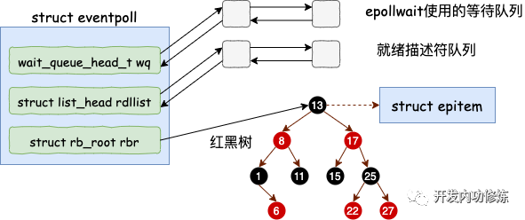
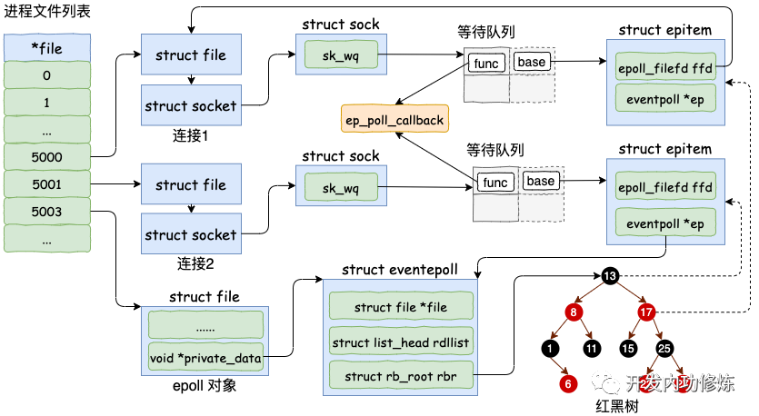

## 一、accept创建新socket
服务器端accept之后，进程会创建一个新的 socket 出来，专门用于和对应的客户端通信，然后把它放到当前进程的打开文件列表中。


其中一条连接的 socket 内核对象更为具体一点的结构图如下。


接下来我们来看一下接收连接时 socket 内核对象的创建源码。
```c
//file: net/socket.c
SYSCALL_DEFINE4(accept4, int, fd, struct sockaddr __user *, upeer_sockaddr,
        int __user *, upeer_addrlen, int, flags)
{
    struct socket *sock, *newsock;

    //根据 fd 查找到监听的 socket
    sock = sockfd_lookup_light(fd, &err, &fput_needed);

    //1.1 申请并初始化新的 socket
    newsock = sock_alloc();
    newsock->type = sock->type;
    newsock->ops = sock->ops;

    //1.2 申请新的 file 对象，并设置到新 socket 上
    newfile = sock_alloc_file(newsock, flags, sock->sk->sk_prot_creator->name);
    ......

    //1.3 接收连接
    err = sock->ops->accept(sock, newsock, sock->file->f_flags);

    //1.4 添加新文件到当前进程的打开文件列表
    fd_install(newfd, newfile);
```

## 二、epoll_create 实现
在用户进程调用 epoll_create 时，内核会创建一个 struct eventpoll 的内核对象。并同样把它关联到当前进程的已打开文件列表中。


对于 struct eventpoll 对象，更详细的结构如下（同样只列出和今天主题相关的成员）。



eventpoll 这个结构体中的几个成员的含义如下：
- wq： 等待队列链表。软中断数据就绪的时候会通过 wq 来找到阻塞在 epoll 对象上的用户进程。
- rbr： 一棵红黑树。为了支持对海量连接的高效查找、插入和删除，eventpoll 内部使用了一棵红黑树。通过这棵树来管理用户进程下添加进来的所有 socket 连接。
- rdllist： 就绪的描述符的链表。当有的连接就绪的时候，内核会把就绪的连接放到 rdllist 链表里。这样应用进程只需要判断链表就能找出就绪进程，而不用去遍历整棵树。


## 三、epoll_ctl 添加 socket
为了简单，我们只考虑使用 EPOLL_CTL_ADD 添加 socket，先忽略删除和更新。在使用 epoll_ctl 注册每一个 socket 的时候，内核会做如下三件事情
1. 分配一个红黑树节点对象 epitem，
2. 2.添加等待事件到 socket 的等待队列中，其回调函数是 ep_poll_callback
3. 3.将 epitem 插入到 epoll 对象的红黑树里

通过 epoll_ctl 添加两个 socket 以后，这些内核数据结构最终在进程中的关系图大致如下：



### 3.1 分配并初始化 epitem
对于每一个 socket，调用 epoll_ctl 的时候，都会为之分配一个 epitem。该结构的主要数据如下：
```c
//file: fs/eventpoll.c
struct epitem {

    //红黑树节点
    struct rb_node rbn;

    //socket文件描述符信息
    struct epoll_filefd ffd;

    //所归属的 eventpoll 对象
    struct eventpoll *ep;

    //等待队列
    struct list_head pwqlist;
}
```


### 3.2 设置 socket 等待队列
在创建 epitem 并初始化之后，ep_insert 中第二件事情就是设置 socket 对象上的等待任务队列。并把函数 fs/eventpoll.c 文件下的 ep_poll_callback 设置为数据就绪时候的回调函数。


## 四、epoll_wait 等待接收
epoll_wait 被调用时，它观察 eventpoll->rdllist 链表里有没有数据即可。有数据就返回，没有数据就创建一个等待队列项，将其添加到 eventpoll 的等待队列上，然后把自己阻塞掉就完事。
```c
//file: fs/eventpoll.c
SYSCALL_DEFINE4(epoll_wait, int, epfd, struct epoll_event __user *, events,
        int, maxevents, int, timeout)
{
    ...
    error = ep_poll(ep, events, maxevents, timeout);
}

static int ep_poll(struct eventpoll *ep, struct epoll_event __user *events,
             int maxevents, long timeout)
{
    wait_queue_t wait;
    ......

fetch_events:
    //4.1 判断就绪队列上有没有事件就绪
    if (!ep_events_available(ep)) {

        //4.2 定义等待事件并关联当前进程
        init_waitqueue_entry(&wait, current);

        //4.3 把新 waitqueue 添加到 epoll->wq 链表里
        __add_wait_queue_exclusive(&ep->wq, &wait);
    
        for (;;) {
            ...
            //4.4 让出CPU 主动进入睡眠状态
            if (!schedule_hrtimeout_range(to, slack, HRTIMER_MODE_ABS))
                timed_out = 1;
            ... 
}
```
## 五、数据来啦
在这一小节里，我们将看到软中断是怎么样在数据处理完之后依次进入各个回调函数，最后通知到用户进程的。

### 5.1 接收数据到任务队列
主要流程：tcp_v4_rcv->tcp_v4_do_rcv->tcp_rcv_established->tcp_queue_rcv,sk_data_ready 


