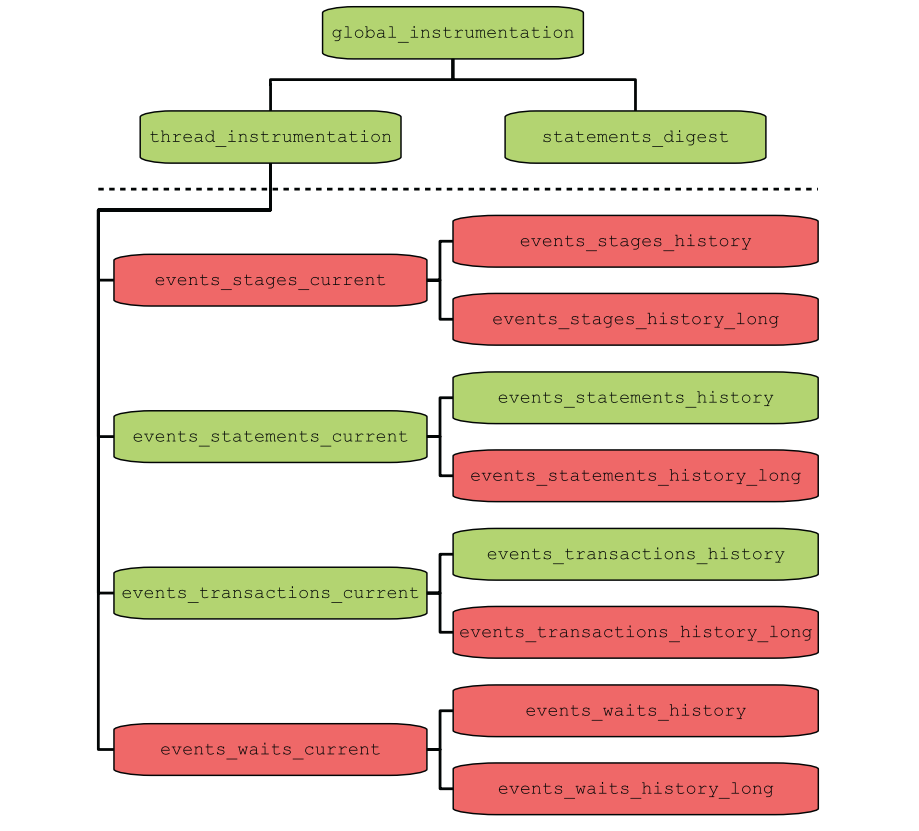
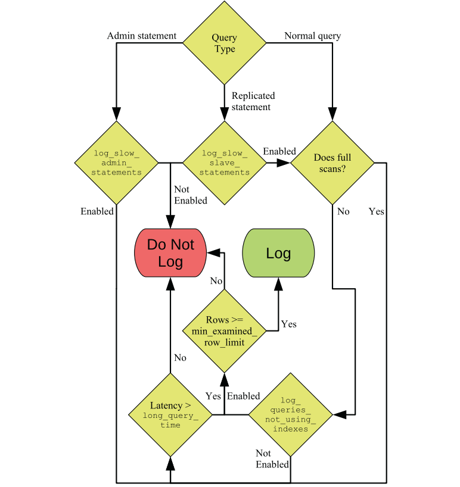

## MySQL优化要注意：

1. 考虑全局：应用层，网络层，MySQL,操作系统，主机
2. 重视监控：
   1. Performance Schema
   2. Information Schema
   3. SHOW 语句
   4. 慢查询日志
   5. explain
   6. 操作系统监控：磁盘、内存和网络等等。

## Performance Schema

### 线程
```sql
SELECT*FROM performance_schema.threads;
```
```sql
-- 当前连接线程
SELECT
	* 
FROM
	PERFORMANCE_SCHEMA.threads 
WHERE
	THREAD_ID = PS_CURRENT_THREAD_ID();
```

### Instruments
Instruments are the code points where the measurements are done.

instruments根据名称分组，命名根据组件分层，便于理解，顶层instrument如下：
| Component   | Timed | Count                   | Description |
| ----------- | ----- | ----------------------- | ----------- |
| error       | no    | Total: 1 Enabled: 1     |             |
| idle        | yes   | Total: 1 Enabled: 1     |             |
| memory      | no    | Total: 511 Enabled: 511 |             |
| stage       | yes   | Total: 119 Enabled: 16  |             |
| statement   | yes   | Total: 212 Enabled: 212 |             |
| transaction | yes   | Total: 1 Enabled: 1     |             |
| wait        | yes   | Total: 384 Enabled: 52  |             |
| error       | no    | Total: 1 Enabled: 1     |             |

**setup_instruments**可以查找和配置所有的instruments：
```sql
SELECT
	NAME,
	ENABLED,
	TIMED,
	DOCUMENTATION
FROM
	PERFORMANCE_SCHEMA.setup_instruments;
```

还可以在mysql配置文件中使用**performance-schema-instrument**选项配置instrument，支持%通配符：
```shell
[mysqld]
performance-schema-instrument = "stage/sql/altering table=ON"
performance-schema-instrument = "memory/%=COUNTED"
```

### Consumers
The consumers are what processes the data generated by the instruments and make it available in the Performance Schema tables. 

**setup_consumers**表可以查看和修改所有的consumers：
```sql
SELECT 
	NAME,
	ENABLED 
FROM
	PERFORMANCE_SCHEMA.setup_consumers;
```
Consumers按照层次组织如下：绿色的默认开启。如果上层的consumer没有启用，即使当前consumer启用了也不会生效。


sys.ps_is_consumer_enabled函数查看某个consumer是否启用：
```sql
SELECT sys.ps_is_consumer_enabled('events_statements_history') AS 是否启用;
```
也支持配置文件中配置开机生效：
```shell
[mysqld]
performance-schema-consumer-events-statements-history-long = ON
```

### Events
An event is the result of a consumer recording the data collected by an instrument and is what you can use to observe what is going on in MySQL. 

四种事件：
- Transactions
- Statements
- Stages
- Waits

每种事件，都有三个consumer，记录不同时间范围的事件：
- current：当前进行的或者最后一个事件
- history：每个线程最后几个（默认10个）事件
- history_long:每个线程最后几个（默认10000个）事件，线程关闭后还会保留

四种事件和三种范围一起构成了12个consumer，对应performance_schema库中的12张表：
```sql
SELECT
	TABLE_NAME 
FROM
	PERFORMANCE_SCHEMA.setup_consumers c
	INNER JOIN information_schema.TABLES t ON t.TABLE_NAME = c.NAME 
WHERE
	t.TABLE_SCHEMA = 'performance_schema' 
ORDER BY
	c.NAME;
```

### Event Nesting
The event tables have two columns to keep track of the relationship between the events:
- NESTING_EVENT_ID: 父事件id
- NESTING_EVENT_TYPE: 父事件类型

The statement event tables have some additional columns related to nested statement events:
- OBJECT_TYPE: The object type of the parent statement event.
- OBJECT_SCHEMA: The schema the parent statement object is stored in.
- OBJECT_NAME: The name of the parent statement object.
- NESTING_EVENT_LEVEL: How deep the statement nesting is. The topmost statement has level 0, and each time a child level is created,NESTING_EVENT_LEVEL increments with one.

**sys.ps_trace_thread()**函数可以打印线程事件树。 

## The sys Schema

### sys Schema Configuration
持久化配置：
```sql
SELECT * FROM sys.sys_config

UPDATE sys.sys_config SET value = 64 WHERE variable = 'statement_truncate_len';
```
当前session：
```sql
SET @sys.statement_truncate_len = 256
```

### Formatting Functions
```sql
SELECT sys.format_bytes(5000) AS SysBytes,FORMAT_BYTES(5000) AS P_SBytes;

SELECT 
  @@global.datadir AS DataDir,
	sys.format_path('D:\\MySQL\\Data_8.0.18\\ib_logfile0') AS LogFile0;
	
SELECT sys.format_statement('SELECT * FROM world.city INNER JOIN world.city ON country.Code = city.CountryCode') AS Statement;

SELECT sys.format_time(123456789012) AS SysTime,FORMAT_PICO_TIME(123456789012) AS P_STime;
```

### The Views
The sys schema provides a number of views that work as predefined reports. 

## SHOW Statement

- Information Schema
- Performance Schema
- Engine Status
- Replication and Binary Logs
- 其它

## The Slow Query Log

### 配置项：
| 配置                                   | 默认值              | 使用范围        | 描述                                      |
| -------------------------------------- | ------------------- | --------------- | ----------------------------------------- |
| slow_query_log                         | OFF                 | Global          |                                           |
| slow_query_log_file                    | <hostname>-slow.log | Global          |                                           |
| min_examined_row_limit                 | 0                   | Global, Session |                                           |
| log_output                             | FILE                | Global          | to a file, a table, or both or not at all |
| log_queries_not_using_indexes          | 0                   | Global          |                                           |
| log_short_format                       | OFF                 | Global          |                                           |
| log_slow_admin_statements              | OFF                 | Global          |                                           |
| log_slow_extra                         | OFF                 | Global          |                                           |
| log_slow_slave_statements              | OFF                 | Global          |                                           |
| log_throttle_queries_not_using_indexes | 0                   | Global          |                                           |
| log_timestamps                         | UTC                 | Global          |                                           |
| long_query_time                        | 10                  | Global,Session  |                                           |

Flowchart to determine whether a query is logged to the slow log：



## MySQL Shell
连接MySQL：
```shell
MySQL  JS > \connect root@localhost
```

## Data Types
You can start asking yourself some questions about the data you need to store in the column. Some examples of questions are as follows:
- What is the native format for the data?
- How large values can be expected initially?
- Will the size of the values grow over time? If so, how much and how quickly?
- How often will the data be retrieved in queries?
- How many unique values do you expect?
- Do you need to index the values? Particularly, is it the primary key of the table?
- Do you need to store the data, or can it, for example, be fetched through a foreign key in another table (using an integer reference column)?

## Indexes
索引是一种数据组织方式，其目的是减少查询时需要检查的数据行数。

MySQL currently supports five different index types:
- B-tree indexes
- Full text indexes
- Spatial indexes (R-tree indexes)
- Multi-valued indexes（MySQL8）
- Hash indexes（adaptive hash indexes）

If InnoDB detects that you are using a secondary index frequently and adaptive hash indexes are enabled, it will build a hash index on the fly of the most frequently used values. 

The hash index is exclusively stored in the buffer pool and thus is not persisted, when you restartMy SQL. If InnoDB detects that the memory can be used better for loading more pages into the buffer pool, it will discard part of the hash index. 

There are two ways to monitor the adaptive hash index: the INNODB_METRICS table in the Information Schema and the InnoDB monitor. The INNODB_METRICS table includes eight metrics for the adaptive hash index with two of them enabled by default.

是否启用自适应哈希索引：
```shell
mysql> SHOW VARIABLES LIKE '%adaptive_hash%'\G
*************************** 1. row ***************************
Variable_name: innodb_adaptive_hash_index
        Value: ON
*************************** 2. row ***************************
Variable_name: innodb_adaptive_hash_index_parts
        Value: 8
```
查看自适应哈希索引的监控状况：
```sql
SELECT NAME,COUNT,STATUS,COMMENT 
FROM information_schema.INNODB_METRICS 
WHERE SUBSYSTEM = 'adaptive_hash_index'
```

## 索引特性
### Functional Indexes(MySQL 8)
In MySQL 8.0.13, You can directly index the result of a function:
```sql
CREATE TABLE db1.person (
  Id int unsigned NOT NULL,
  Name varchar(50) NOT NULL,
  Birthdate date NOT NULL,
 
  PRIMARY KEY (Id),
  INDEX ((MONTH(Birthdate)))
);
```
### Prefix Indexes
you can only index the first part of the string value. That is called a prefix index.
```sql
ALTER TABLE world.city ADD INDEX (Name(10));
```
如何决定前缀的长度？当索引选择性越接近全列选择性的时候，索引效果越好。

```sql
SELECT 
  COUNT(DISTINCT name) / COUNT(*) AS 全列选择性, 
  COUNT(DISTINCT LEFT(name, 5)) / COUNT(*) AS 前缀索引选择性（5）,
  COUNT(DISTINCT LEFT(name, 10)) / COUNT(*) AS 前缀索引选择性（10）
FROM 
  world.city;
```
### Invisible Indexes(MySQL 8)
可以将索引设置不可见，这样优化器（默认）就不会使用该索引：
```sql
ALTER TABLE world.city ADD INDEX (Name) INVISIBLE;

-- 默认是off
SET SESSION optimizer_switch = 'use_invisible_indexes=on'
```

### Descending Indexes(MySQL 8)
逆序索引按逆序排序：
```sql
ALTER TABLE world.city ADD INDEX (Name DESC);
```
### Partitioning and Indexes
查询条件中含分区键时，会直接过滤分区。

### Auto-generated Indexes
For queries that include subqueries joined to other tables or subqueries, the join can be expensive as subqueries cannot include explicit indexes. To avoid doing full table scans on these temporary tables generated by subqueries, MySQL can add an automatically generated index on the join condition.
