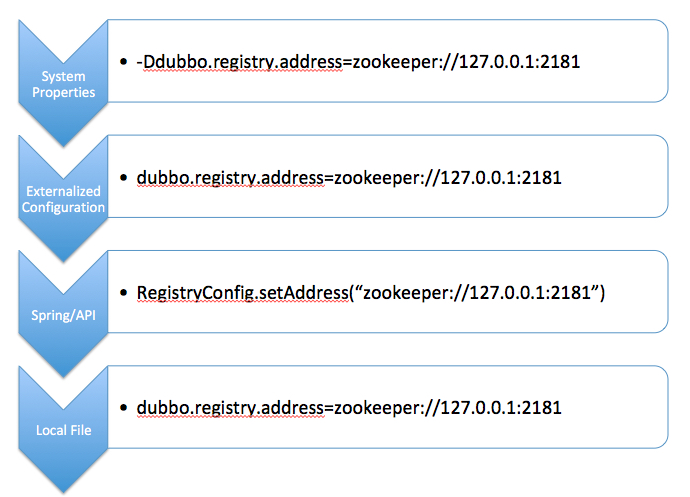

## Dubbo 配置
Dubbo支持的配置方式：
|配置方式|描述|
|----|----|
|XML配置|以 XML 配置的方式来配置你的 Dubbo 应用|
|动态配置中心|Dubbo 2.7 中的动态配置中心|
|属性配置|以属性配置的方式来配置你的 Dubbo 应用|
|自动加载环境变量|在 Dubbo 中自动加载环境变量
|API 配置|以API 配置的方式来配置你的 Dubbo 应用
|注解配置|以注解配置的方式来配置你的 Dubbo 应用

## 配置加载流程

配置加载流程是指在应用启动阶段，Dubbo框架如何将所需要的配置采集起来（包括应用配置、注册中心配置、服务配置等），以完成服务的暴露和引用流程。

首先，Dubbo默认有四种配置来源：
- JVM System Properties，-D 参数
- Externalized Configuration，外部化配置
- ServiceConfig、ReferenceConfig 等编程接口采集的配置
- 本地配置文件 dubbo.properties

配置覆盖关系的优先级，从上到下优先级依次降低：



## 配置格式
应用级别
```properties
dubbo.application.name=demo-provider
dubbo.registry.address=zookeeper://127.0.0.1:2181
dubbo.protocol.port=-1
```
服务级别
```properties
dubbo.service.org.apache.dubbo.samples.api.DemoService.timeout=5000
dubbo.reference.org.apache.dubbo.samples.api.DemoService.timeout=6000
dubbo.reference.org.apache.dubbo.samples.api.DemoService.sayHello.timeout=7000
```
多配置项
```properties
dubbo.registries.unit1.address=zookeeper://127.0.0.1:2181
dubbo.registries.unit2.address=zookeeper://127.0.0.1:2182

dubbo.protocols.dubbo.name=dubbo
dubbo.protocols.dubbo.port=20880
dubbo.protocols.hessian.name=hessian
dubbo.protocols.hessian.port=8089
```
扩展配置
```properties
dubbo.application.parameters.item1=value1
dubbo.application.parameters.item2=value2
dubbo.registry.parameters.item3=value3
dubbo.reference.org.apache.dubbo.samples.api.DemoService.parameters.item4=value4
```