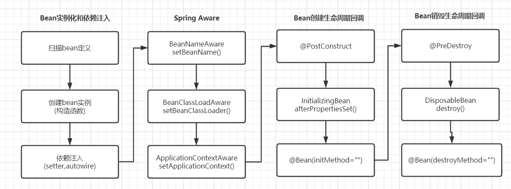

## IOC概念
IoC的核心是提供一种更简单的机制来配置组件的依赖，并在其整个生命周期中管理这些依赖。IOC分为依赖注入和依赖查找，依赖注入应用更广泛。

Spring IOC核心接口
- **BeanDefinition**：bean定义。
- **BeanFactory**：IOC容器最高抽象。实现参考DefaultListableBeanFactory
- **BeanDefinitionRegistry**：bean注册中心。实现参考DefaultListableBeanFactory
- **BeanDefinitionReader** 读取bean定义。实现参考XmlBeanDefinitionReader
- **ApplicationContext**: BeanFactory的扩展，提供更多企业级特性。实现参考AnnotationConfigApplicationContext

bean容器也会实现BeanDefinitionRegistry，这样才能管理所有注册的bean。BeanDefinitionReader的loadBeanDefinitions把bean配置元数据加载到BeanDefinitionRegistry。

```java
public class XmlConfigWithBeanFactory {
    public static void main(String... args) {
        DefaultListableBeanFactory factory = new DefaultListableBeanFactory();
        XmlBeanDefinitionReader rdr = new XmlBeanDefinitionReader(factory);
        rdr.loadBeanDefinitions(new ClassPathResource("spring/xml-bean-factory-config.xml"));
        Oracle oracle = (Oracle) factory.getBean("oracle");
        System.out.println(oracle.defineMeaningOfLife());
    }
}
```

## Bean生命周期：



## FactoryBean:

```java
package com.example.demo;

import org.springframework.beans.factory.FactoryBean;
import org.springframework.beans.factory.InitializingBean;

import java.security.MessageDigest;

/**
 * MessageDigest bean的工厂bean，根据algorithmName返回指定的MessageDigest bean。
 */
public class MessageDigestFactoryBean implements FactoryBean<MessageDigest>, InitializingBean {
    private String algorithmName = "MD5";
    private MessageDigest messageDigest = null;

    @Override
    public MessageDigest getObject() throws Exception {
        return messageDigest;
    }

    @Override
    public Class<?> getObjectType() {
        return MessageDigest.class;
    }

    @Override
    public boolean isSingleton() {
        return true;
    }

    @Override
    public void afterPropertiesSet() throws Exception {
        messageDigest = MessageDigest.getInstance(algorithmName);
    }

    public void setAlgorithmName(String algorithmName) {
        this.algorithmName = algorithmName;
    }
}
```
```java
package com.example.demo;

import java.security.MessageDigest;

/**
 * MessageDigester使用了两种MessageDigest
 */
public class MessageDigester {
    private MessageDigest digest1;
    private MessageDigest digest2;

    public void setDigest1(MessageDigest digest1) {
        this.digest1 = digest1;
    }

    public void setDigest2(MessageDigest digest2) {
        this.digest2 = digest2;
    }

    public void digest(String msg) {
        System.out.println("Using digest1");
        digest(msg, digest1);
        System.out.println("Using digest2");
        digest(msg, digest2);
    }

    private void digest(String msg, MessageDigest digest) {
        System.out.println("Using alogrithm: " + digest.getAlgorithm());
        digest.reset();
        byte[] bytes = msg.getBytes();
        byte[] out = digest.digest(bytes);
        System.out.println(out);
    }
}
```
```java
package com.example.demo;

import org.springframework.beans.BeansException;
import org.springframework.beans.factory.support.DefaultListableBeanFactory;
import org.springframework.beans.factory.xml.XmlBeanDefinitionReader;
import org.springframework.boot.ApplicationArguments;
import org.springframework.boot.ApplicationRunner;
import org.springframework.boot.SpringApplication;
import org.springframework.boot.autoconfigure.SpringBootApplication;
import org.springframework.context.ApplicationContext;
import org.springframework.context.ApplicationContextAware;
import org.springframework.context.annotation.Bean;
import org.springframework.core.io.ClassPathResource;

@SpringBootApplication
public class DemoApplication implements ApplicationRunner, ApplicationContextAware {

    @Bean
    public MessageDigestFactoryBean defaultDigest() {
        return new MessageDigestFactoryBean();
    }

    @Bean
    public MessageDigestFactoryBean shaDigest() {
        MessageDigestFactoryBean factoryBean = new MessageDigestFactoryBean();
        factoryBean.setAlgorithmName("SHA1");
        return factoryBean;
    }

    @Bean
    public MessageDigester messageDigester() throws Exception {
        MessageDigester digester = new MessageDigester();
        digester.setDigest1(defaultDigest().getObject());
        digester.setDigest2(shaDigest().getObject());
        return digester;
    }

    public static void main(String[] args) {
        SpringApplication.run(DemoApplication.class, args);
    }

    private ApplicationContext ctx;

    @Override
    public void setApplicationContext(ApplicationContext applicationContext) throws BeansException {
        this.ctx = applicationContext;
    }

    @Override
    public void run(ApplicationArguments args) throws Exception {
        MessageDigester digester = (MessageDigester) ctx.getBean("messageDigester");
        digester.digest("Hello World!");
    }
}
```
## MessageSource
国际化配置：
```properties
#src/main/resources/i18n/labels.properties
msg=言多必失
nameMsg=我叫 {0} {1}

#src/main/resources/i18n/labels_de_DE.properties
msg=Mein dummer Mund hat mich in Schwierigkeiten gebracht
nameMsg=Mein Name ist {0} {1}

#src/main/resources/i18n/labels_en.properties
msg=My stupid mouth has got me in trouble
nameMsg=My name is {0} {1}
```
application.properties指定路径：
```properties
spring.messages.basename=i18n/labels,i18n/buttons
```