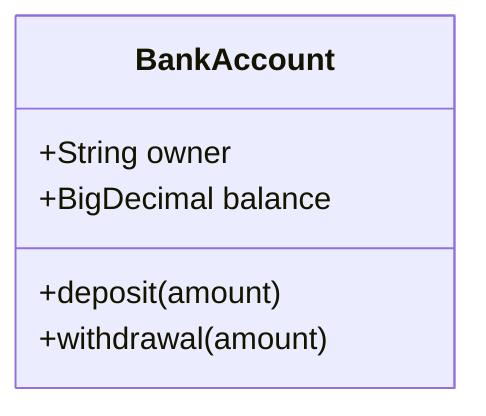
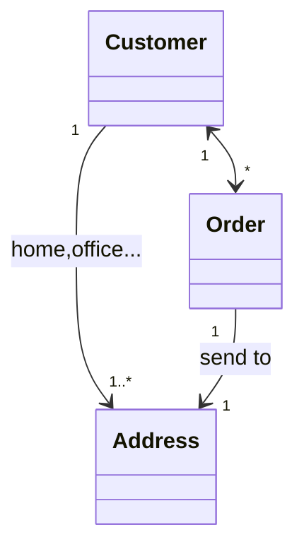
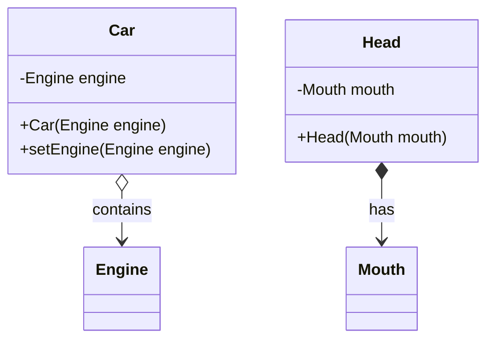
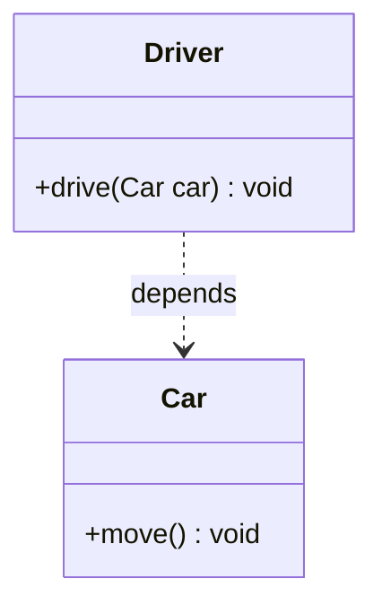
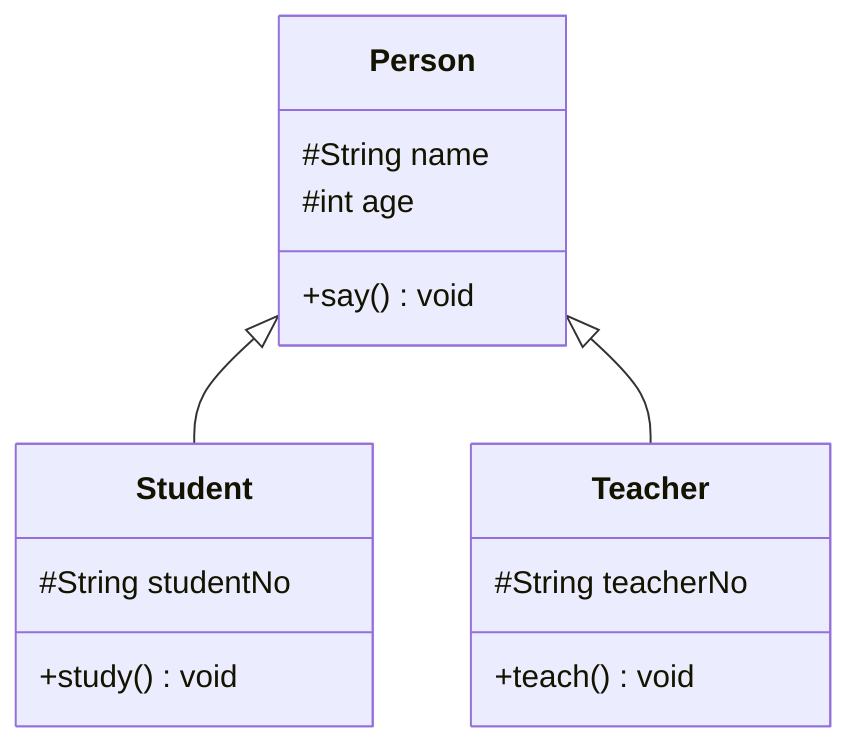
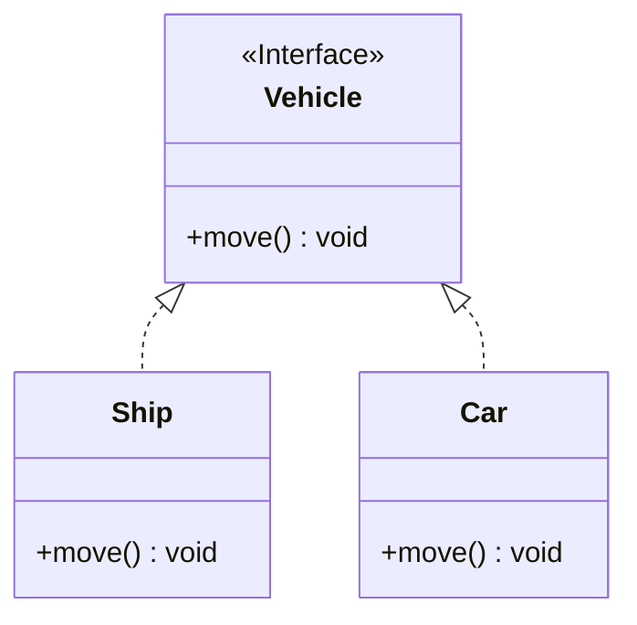

## UML 概述

一些科普知识：

- UML（Unified Model Language）
- UML三友：Booch 方法，OMT（Object Model Technology），OOSE（Object Orient Software Design）
- Rational 软件
- OMG（Object Management Group）

### UML结构

UML是一种由图形符号表达的建模语言，其结构主要包括以下几个部分：

**视图：描述系统各个方面。**

每个视图显示系统模型的一个特定方面。UML视图包括：

- 用户视图：描述目标和需求。以用户的观点表示系统的目标和需求；
- 结构视图：描述静态行为。系统的静态元素如包，类与对象，以及它们之间的关系；
- 行为视图：描述动态行为。系统的组成元素（如对象）在系统运行时的交互关系；
- 实现视图：描述逻辑元素的分布。系统中物理文件以及它们之间的关系；
- 环境视图：描述物理元素的分布。系统中硬件设备以及它们之间的关系。

**图：描述视图的内容。**

UML 2.0 提供了 13 种图：

- 用例图
- 类图
- 对象图
- 包图
- 组合结构图
- 状态图
- 活动图
- 顺序图
- 通信图
- 定时图（Timing Diagram）
- 交互概览图
- 组件图
- 部署图

图和视图对应关系：

| 视图     | 图                                                 |
| :------- | :------------------------------------------------- |
| 用户视图 | 用例图                                             |
| 结构视图 | 类图，对象图，包图，组合结构图                     |
| 行为视图 | 状态图，活动图，顺序图，通信图，定时图，交互概览图 |
| 实现视图 | 组件图                                             |
| 环境视图 | 部署图                                             |

**模型元素：对应于面向对象概念及其关系。**

类、对象、消息以及它们之间的关系，如关联关系、依赖关系、泛化关系。

## 类图

类图用来描述不同的类以及它们之间的关系。UML 类图使用长方形表示，里面包含类名、属性和操作（分割线分割）。

属性的格式：`可见性 名称 ：类型 [ = 默认值]`

操作的格式：`可见性 名称（ 参数列表 ） [ ：返回值 ]`

示例：银行账号类

### 类之间的关系

概况来讲，类之间的关系有：

- 关联关系
- 依赖关系
- 泛化关系
- 接口与实现关系

#### 关联关系

关联关系是一种结构化关系，用于表示一类对象和另一类对象之间有联系，如汽车和轮胎、师傅和徒弟。通常关联关系实现为一个类的对象作为另一个类的成员变量。

根据关联方向，关联关系分为：

- 单向关联：顾客 填写 地址
- 双向关联：顾客 购买 订单（多个），订单 属于 顾客（单个）
- 自关联：节点 包含 子节点，它们都是 Node 类

根据关联对象数量，关联关系可以分为：

- 1对1关联
- 1对多关联
- 多对多关联

例如：顾客，地址，订单三者简单关系

根据生命周期，关联关系分为：

- 聚合关系：汽车 包含（contains） 发动机 ，汽车没了，发动机可能还有用。
- 组合关系：头 有（has） 嘴巴，头没了，嘴巴也没了。

#### 依赖关系

依赖关系是一种使用关系，当被依赖（使用）对象发生改变时，可能会影响依赖（使用）它的对象。建立依赖关系的常见方法有：被依赖对象作为方法参数或局部变量，调用被依赖对象的静态方法等等。

#### 泛化关系(继承)

#### 接口与实现

